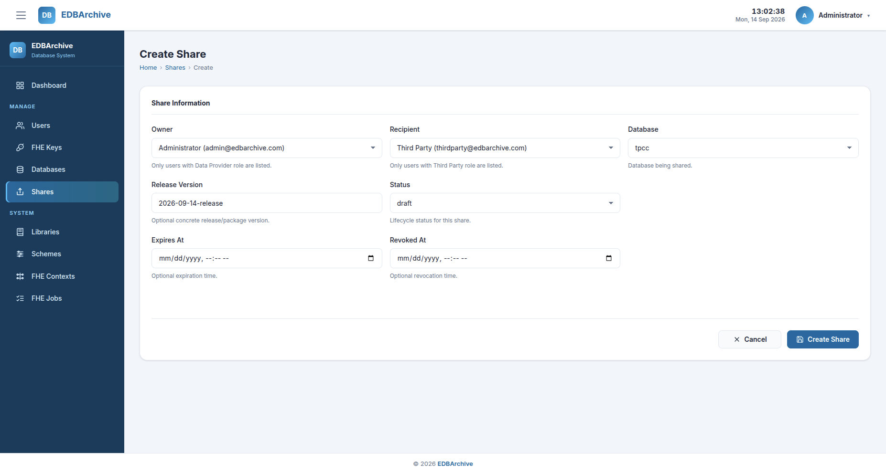
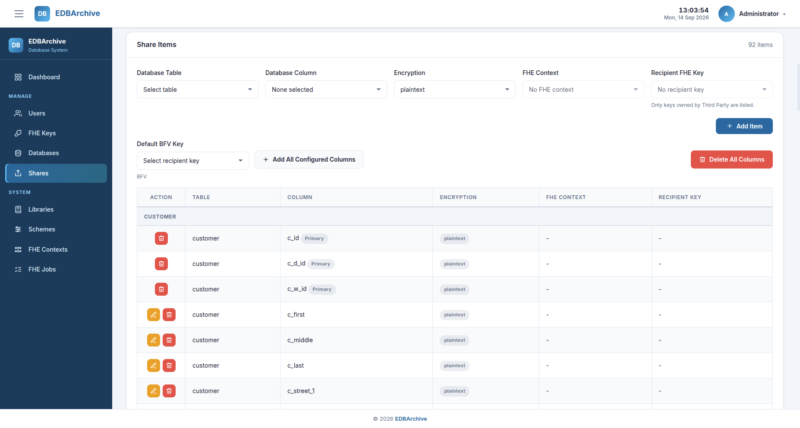
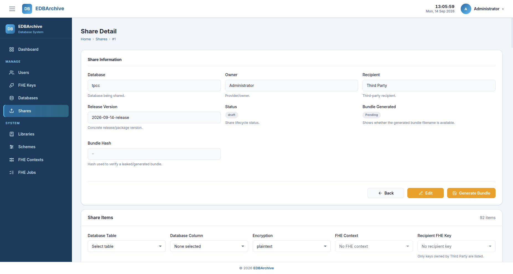
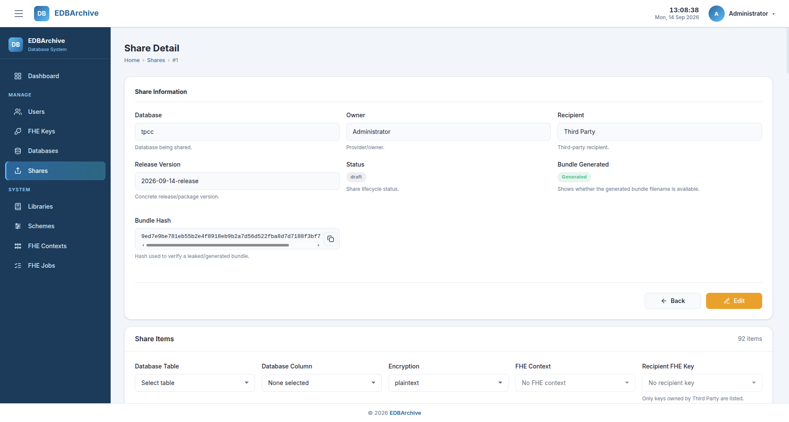
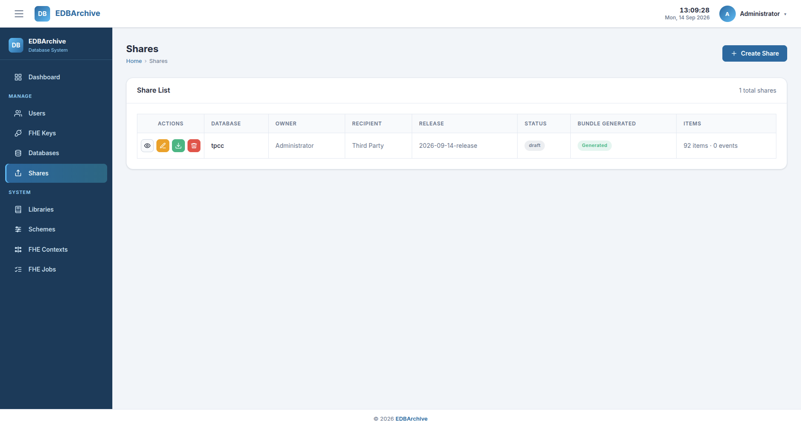

# Bundle Generation

A share defines the database content delivered to a third party and the
protection applied to each included column. After the share items have been
reviewed, EDBArchive creates a compressed `bundle.tar.gz` that can be restored
with the standalone third-party component.

Creating another bundle does not require recreating the library, scheme,
context, key, or database metadata. A new share can reuse those system-wide
resources when they remain suitable for its database and recipient.

For the reproducibility scenario, the bundle includes every configured TPC-C
table and column. Only `district.d_next_o_id` is protected with FHE; all other
columns remain plaintext.

## Bundle workflow

```text
Create share metadata
          |
          v
Add all configured database columns
          |
          v
Assign the recipient key and review protection
          |
          v
Generate bundle through the job queue
          |
          v
Review the job result and bundle hash
          |
          v
Download bundle.tar.gz
```

## Prerequisites

Before creating the share, ensure that:

- the database configuration includes every TPC-C table and column.
- `district.d_next_o_id` has default protection `fhe-secure`.
- the BFV context has status `generated`.
- the Third Party key has generation status `generated` and lifecycle status
  `active`.
- the key owner is the intended share recipient.

See [FHE Resources](fhe-resources.md) and
[Database Configuration](database-configuration.md) if these resources have
not been prepared.

## 1. Create a share

From the sidebar, open **Shares**, then select **Create Share**.

Complete the form for the reproducibility scenario:

| Field | Value |
|---|---|
| Owner | `Administrator (admin@edbarchive.com)` |
| Recipient | `Third Party (thirdparty@edbarchive.com)` |
| Database | `tpcc` |
| Release Version | Keep the generated value or enter a descriptive version |
| Status | `draft` |
| Expires At | Leave empty |
| Revoked At | Leave empty |



*Share creation form for the TPC-C reproducibility bundle.*

Select **Create Share**. The application saves the share and opens its Share
Detail page. A newly created share does not yet contain any share items.

## 2. Add all configured columns

The **Share Items** section supports adding columns individually or adding all
database columns previously enabled through **Configure Columns**.

For the reproducibility scenario, select the generated Third Party key in the
key field shown for the BFV context. Then select
**Add All Configured Columns** and confirm with **Add All**.



*Bulk-add action with the recipient key selected for the BFV context.*

EDBArchive copies the database-level defaults into the new share items:

- every configured table and column is included.
- primary-key columns remain plaintext.
- `district.d_next_o_id` uses `fhe-secure`, the generated BFV context, and the
  selected recipient key.
- every other column remains plaintext without an FHE context or key.

Only keys owned by the selected share recipient are shown. The bulk-add button
is unavailable if an FHE column has no context or the recipient has no key for
that context.

Bulk-add skips share items that already exist; it does not overwrite them.

## 3. Review the share items

Review the Share Items table before generating the bundle. Confirm that:

- every configured TPC-C column is listed.
- `district.d_next_o_id` is the only row marked `fhe-secure`.
- that row references the generated BFV context.
- that row references the key owned by `Third Party`.
- every other row is marked `plaintext`.

Non-primary items can be corrected with their **Edit** action. Primary-key
items cannot be changed to FHE protection. Deleting a primary-key item removes
all share items belonging to that table, because a shared table cannot be
restored without its primary key.

Review the configuration carefully before continuing. After a bundle is
generated, EDBArchive returns the existing bundle instead of generating a new
one for the same share. Later metadata changes do not modify that existing
bundle.

## 4. Generate the bundle

On the Share Detail page, select **Generate Bundle**, then confirm with
**Generate** in the **Generate share bundle?** dialog.



*Share Detail page.*

The action queues a `backup` job and changes the bundle status to
`Processing`. During the job, EDBArchive:

1. creates a temporary duplicate of the source database.
2. retains the tables and columns selected in the share.
3. encrypts `district.d_next_o_id` with the configured OpenFHE context and key.
4. stores packed ciphertexts as binary files.
5. exports the prepared database structure and remaining data to `dump.sql`.
6. writes the FHE and reconstruction metadata.
7. packages the public restoration artifacts.
8. compresses them as `bundle.tar.gz`.

The source `tpcc` database is not modified. Encryption and preparation operate
on the temporary database copy.

## 5. Monitor the backup job

Open **FHE Jobs** and locate the `Backup` job for the share. Reload the page
until its status becomes `completed` or `failed`.

The FHE Job detail page provides:

- the complete input payload.
- provider-side timing measurements.
- generated artifact metadata and size.
- standard output and standard error.
- structured error information if the job fails.

If the job fails, correct the reported problem and use **Generate Bundle** to
retry. See [Troubleshooting](../troubleshooting.md) for common causes.

## 6. Confirm the generated artifact

When the job completes, return to the Share Detail page. It should display:

- **Bundle Generated:** `Generated`; and
- **Bundle Hash:** the SHA-256 digest calculated from the final bundle.



*Completed Share Detail page showing the generated state and bundle hash.*

The final artifact is stored in the shared application storage using this
reference:

```text
public/<job-id>/bundle.tar.gz
```

The bundle contains the database dump, packed ciphertexts, FHE context,
evaluation material, and restoration metadata. It does not contain the public
or private key.

## 7. Download the bundle

Return to the **Shares** list. A **Download** action is displayed for the share
after its bundle reference has been published.



*Shares list with the Download action available.*

Select **Download** and retain the resulting `bundle.tar.gz`. This file is the
input to the [Third-party Restoration Guide](../third-party-guide.md).

For reproducibility, keep the SHA-256 value shown on the Share Detail page with
the downloaded bundle. On Linux, it can be checked independently with:

```bash
sha256sum /absolute/path/to/bundle.tar.gz
```

The calculated value should match the hash recorded by EDBArchive.

## Expected result

Bundle generation is complete when:

- the backup job status is `completed`.
- the share bundle status is `Generated`.
- a SHA-256 bundle hash is displayed.
- the Download action returns a non-empty `bundle.tar.gz`.
- the downloaded file's SHA-256 digest matches the value shown by EDBArchive.

## Navigation

- Previous: [Database Configuration](database-configuration.md)
- Guide index: [Data Provider Guide](index.md)
- Next: [Third-party Restoration Guide](../third-party-guide.md)
- [Documentation index](../index.md)
