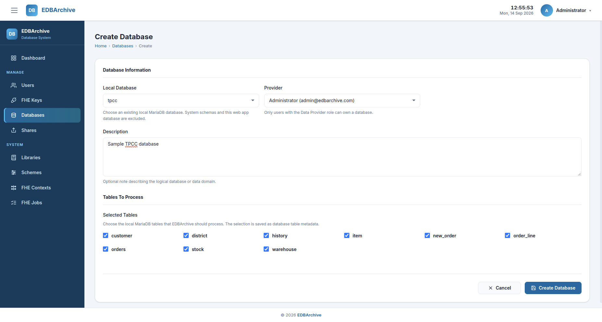
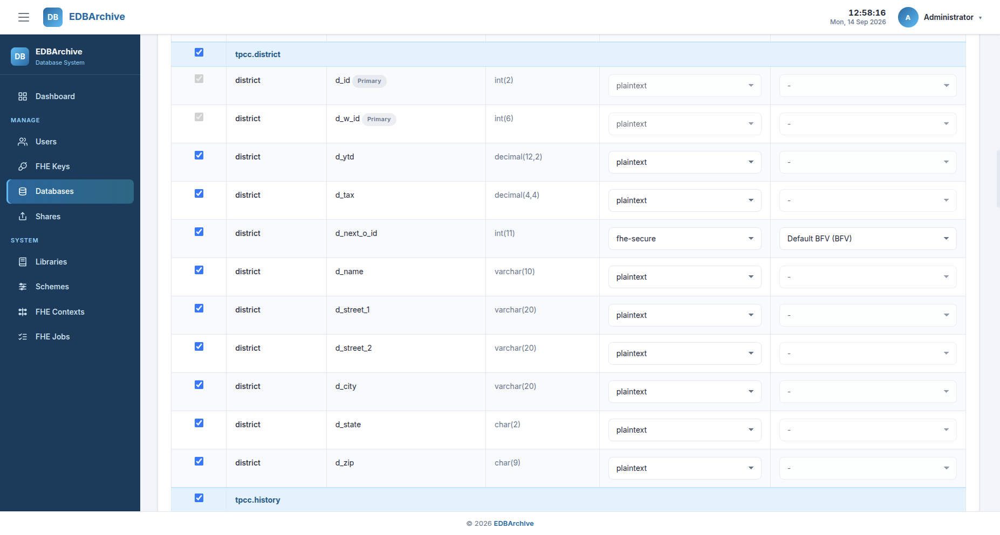

# Database Configuration

Database configuration records which existing MariaDB database, tables, and
columns EDBArchive may include in a share. This step stores metadata only. It
does not copy table rows, modify the source database, or encrypt any value.

The resulting configuration is a system-wide reusable template. Multiple
shares can use the same registered database, table selection, column metadata,
and protection defaults. Register and configure the database again only when a
different source or a separate template is required.

For the reproducibility scenario, register the included `tpcc` database,
enable all of its tables and columns, and set only
`district.d_next_o_id` to use FHE by default.

## Configuration workflow

```text
Select the existing tpcc database
               |
               v
Register all TPC-C tables
               |
               v
Open Configure Columns
               |
               v
Enable all columns
               |
               v
Keep all columns plaintext except
district.d_next_o_id -> fhe-secure
```

## Prerequisites

This guide assumes that:

- EDBArchive has been installed and its services are running.
- the `tpcc` database was populated during MariaDB initialization.
- the Data Provider account is available.
- the BFV context from [FHE Resources](fhe-resources.md) has status
  `generated`.

Sign in using the provided Data Provider account:

| Email | Password |
|---|---|
| `admin@edbarchive.com` | `edbarchive` |

## 1. Register the database and tables

From the sidebar, open **Databases**, then select **Create Database**.

Complete the database information:

| Field | Reproducibility value |
|---|---|
| Local Database | `tpcc` |
| Provider | `Administrator (admin@edbarchive.com)` |
| Description | Optional, for example `TPC-C reproducibility database` |

After selecting `tpcc`, the **Tables To Process** section displays the base
tables discovered from that database. Select every listed table so that the
complete TPC-C database is represented in the share.



*Database registration form with the TPC-C tables selected.*

Select **Create Database**. EDBArchive saves the database and table metadata
and automatically registers the primary-key columns found in each selected
table.

System schemas, the EDBArchive application database, and databases that have
already been registered are excluded from the **Local Database** list.

## 2. Open the column configuration

In the Databases list, select **View** for `tpcc`. The Database Detail page
shows the registered tables and the current number of configured columns for
each table.

Select **Configure Columns** to open the column-level metadata form.

This page reads the column name, order, data type, and primary-key status from
the source database. It does not read or store the row values.

## 3. Enable all TPC-C columns

The **Use** checkbox determines whether a column is available for sharing. For
each TPC-C table, select the checkbox in the table header to enable all of its
columns.

Primary-key columns are enabled automatically. They cannot be disabled or
encrypted because EDBArchive needs their plaintext values to associate the
reconstructed ciphertexts with the correct rows.

## 4. Configure the protected column

Keep the following defaults for every column other than
`district.d_next_o_id`:

| Field | Value |
|---|---|
| Use | Selected |
| Encryption | `plaintext` |
| FHE Context | `-` |

For the `district.d_next_o_id` row, use:

| Field | Value |
|---|---|
| Use | Selected |
| Encryption | `fhe-secure` |
| FHE Context | The generated BFV context |

Selecting `fhe-secure` makes the FHE Context field required. The context field
is disabled and cleared automatically for plaintext columns.



*All TPC-C columns enabled, with only `district.d_next_o_id` configured for
FHE protection.*

Select **Save Columns** to store the configuration.

## Expected result

Return to the Database Detail page. Every selected TPC-C table should show its
configured column count. The database metadata is ready for bundle generation
when:

- all TPC-C tables are registered.
- all columns are enabled.
- all primary-key columns are plaintext.
- `district.d_next_o_id` has default encryption `fhe-secure` and references
  the generated BFV context.
- every other column has default encryption `plaintext`.

These values are database-level defaults. When all configured columns are
added to a share, EDBArchive copies these defaults into the corresponding
share items. Protection can still be reviewed on the Share Detail page before
generating the bundle.

## Metadata and source data

The configuration stored by EDBArchive describes the selected database,
tables, columns, column ordering, default protection type, and associated FHE
context. The source TPC-C rows remain in the MariaDB `tpcc` database and are
not changed by this process.

Deleting the database record through the EDBArchive web application removes
its metadata only; it does not drop the underlying MariaDB database.

## Navigation

- Previous: [FHE Resources](fhe-resources.md)
- Guide index: [Data Provider Guide](index.md)
- Next: [Bundle Generation](bundle-generation.md)
- [Documentation index](../index.md)
