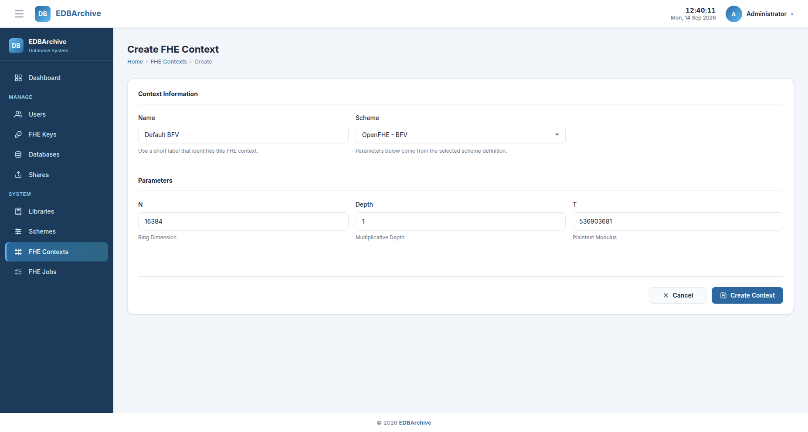
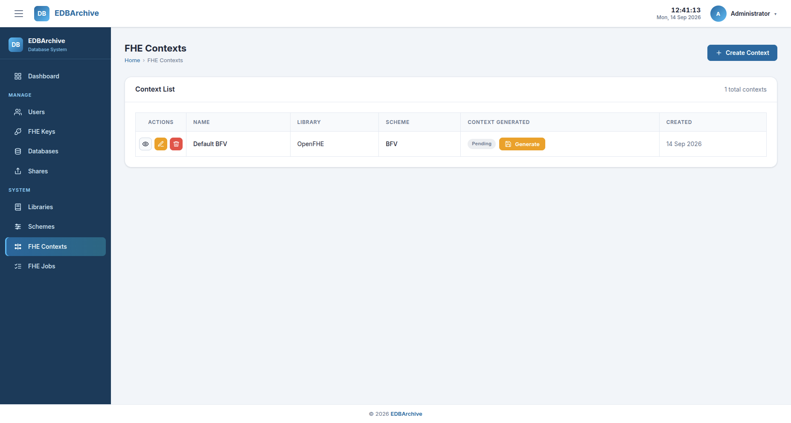
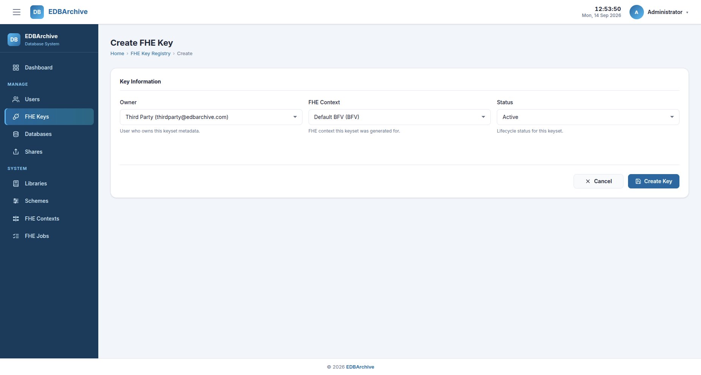
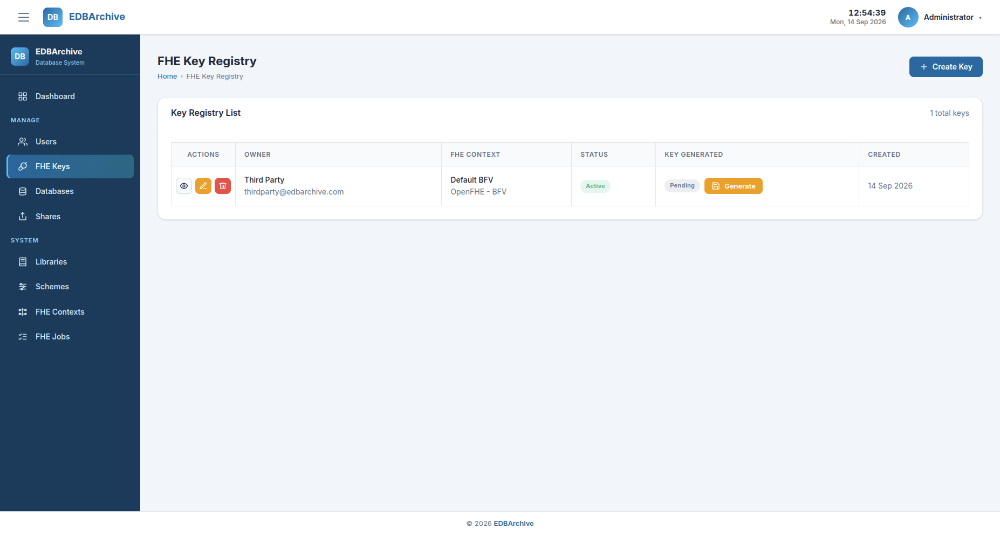

# FHE Resources

FHE resources must be available before a database column can be protected or a
share bundle can be generated. Libraries, schemes, and contexts are
system-wide resources rather than per-share configuration. A generated context
can be reused across multiple compatible keys and shares.

The data provider needs to create and generate a context only when no suitable
context already exists. Likewise, an existing generated key can be reused for
multiple shares when it belongs to the same recipient and context and its
lifecycle status remains appropriate.

The default installation already provides the OpenFHE library and BFV scheme.
They do not need to be created again for the reproducibility scenario.

## Resource workflow

```text
Create FHE context record
          |
          v
Generate context through the job queue
          |
          v
Create key registry record for the recipient
          |
          v
Generate key pair through the job queue
          |
          v
Use the generated context and key in a share
```

Creating a record and generating its cryptographic artifact are separate
operations. A newly created context or key therefore has status `pending`
until its generation job completes. Once generated, it remains available for
selection by later database and share configurations.

## Prerequisites

This guide assumes that:

- [Installation and Setup](../installation.md) has been completed.
- the EDBArchive services are running.
- the OpenFHE BFV scheme is available.
- the user who will receive the share already exists.

For the provided reproducibility scenario, sign in using the Data Provider
account:

| Email | Password |
|---|---|
| `admin@edbarchive.com` | `edbarchive` |

## 1. Create an FHE context

From the sidebar, open **FHE Contexts**, then select **Create Context**.

Complete the form as follows:

| Field | Reproducibility value |
|---|---|
| Name | A descriptive name, such as `TPCC BFV Context` |
| Scheme | `OpenFHE - BFV` |
| Parameters | Keep the default values displayed by the form |

The parameter fields are generated from the BFV scheme definition stored in
the application database. For the small reproducibility scenario, use these
defaults without modification.



*FHE context creation form.*

Select **Create Context** to save the record. The application returns to the
FHE Contexts list and initially displays the context status as `pending`.

## 2. Generate the FHE context

Find the newly created context in the FHE Contexts list and select
**Generate**. Confirm the action in the **Generate FHE context?** dialog.



*FHE context list and generation action.*

This action queues a `create-context` job and wakes the Python worker. The
status progresses through the following states:

```text
pending -> queued -> processing -> generated
```

Reload the page to see the latest status. Do not create the key pair until the
context status is `generated`.

If the status becomes `failed`, open **FHE Jobs**, select the corresponding
`Create Context` job, and inspect its error, result payload, standard output,
and standard error. See [Troubleshooting](../troubleshooting.md) for additional
diagnostic steps.

## 3. Create a key registry record

From the sidebar, open **FHE Keys**, then select **Create Key**.

Complete the form as follows:

| Field | Reproducibility value |
|---|---|
| Owner | `Third Party (thirdparty@edbarchive.com)` |
| FHE Context | The generated context created above |
| Status | `Active` |



*FHE key registry creation form.*

The owner is the user for whom the key registry metadata is created. When the
key is later selected for an FHE-protected share item, its owner must match the
recipient of that share.

Select **Create Key** to save the registry record. Its generation status is
initially `pending`.

## 4. Generate the key pair

Find the new record in the FHE Key Registry list and select **Generate**.
Confirm the action in the **Generate FHE key?** dialog.



*FHE key registry list and generation action.*

This action queues a `create-keypair` job. Reload the page until the generation
status becomes `generated`:

```text
pending -> queued -> processing -> generated
```

If generation fails, inspect the corresponding job through **FHE Jobs** before
retrying.

## Expected result

The FHE resource preparation is complete when:

- the FHE context status is `generated`.
- the key generation status is `generated`.
- the key lifecycle status is `active`.
- the key owner is the intended share recipient.

The generated context and key can now be selected when configuring an
FHE-protected share item. The current implementation uses one library, scheme,
context, and key pair for the protected columns in a bundle.

## Key handling

Context and key artifacts are generated in the data provider's private shared
storage. The key registry owner records which recipient the key metadata is
associated with. It does not cause the public or private key to be included in
the generated bundle.

The final bundle excludes both the public and private keys. It includes only
the context, evaluation material, ciphertexts, and reconstruction metadata
needed by the third party to restore and homomorphically process the protected
data.

## Navigation

- Previous: [Data Provider Guide](index.md)
- Next: [Database Configuration](database-configuration.md)
- [Documentation index](../index.md)
