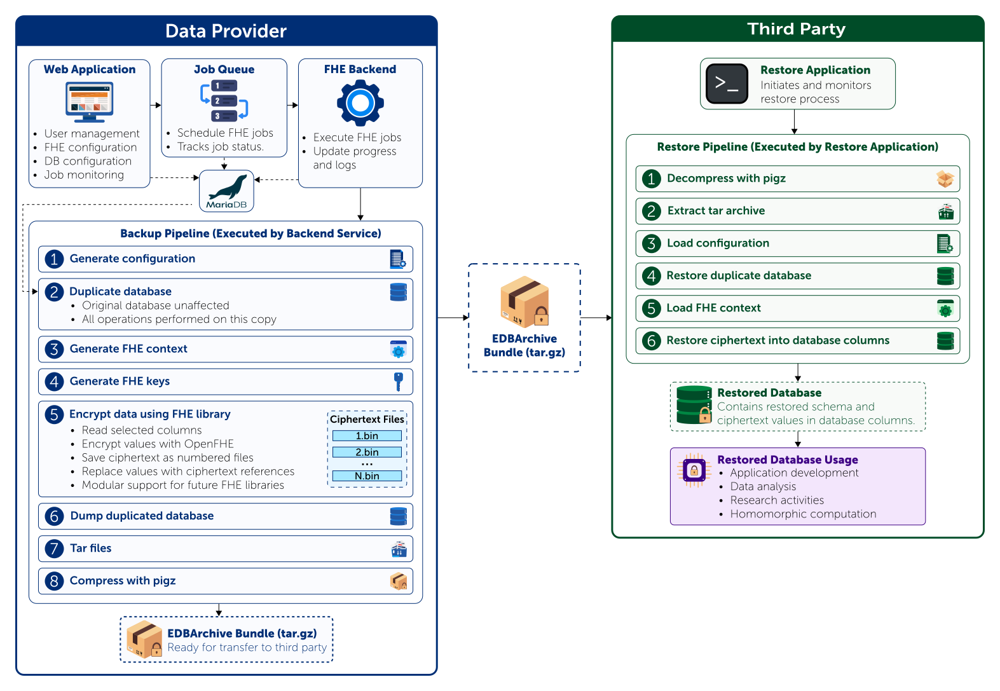

# EDBArchive Documentation

EDBArchive is a storage-efficient backup and restoration system for fully
homomorphically encrypted relational database sharing.

This documentation covers installation, configuration, data-provider
operations, third-party restoration, and reproduction of the paper artifact.

## Documentation

- [System Architecture](architecture.md)
- [Installation and Setup](installation.md)
- [Data Provider Guide](data-provider/index.md)
- [Third-party Restoration Guide](third-party-guide.md)
- [Paper Reproducibility](reproducibility.md)
- [Troubleshooting](troubleshooting.md)

## System overview

EDBArchive consists of a Laravel management application, a Python job worker,
an OpenFHE backend, and MariaDB. The generated backup bundle is restored
separately using the third-party CLI.

## Current implementation

- OpenFHE 1.4.0
- BFV scheme
- MariaDB 12.1.2
- MariaDB Connector/C++ 1.1.7
- Integer-valued protected columns
- One FHE library, scheme, context, and key pair per bundle
- Docker support for Linux amd64 and ARM64

## Reproducibility artifact

The repository includes the TPCC database used by the Docker-based
reproducibility environment. Instructions for building the containers,
generating an encrypted bundle, and restoring it are provided in the
[reproducibility guide](reproducibility.md).

Generated bundles exclude both the public and private keys. A recipient can
restore and homomorphically process the existing ciphertexts using the included
context and evaluation material, but cannot decrypt them using the bundle
contents.

## Project links

- [Source repository](https://github.com/donispambudi/EDBArchive)
- [MIT License](https://github.com/donispambudi/EDBArchive/blob/main/LICENSE)
